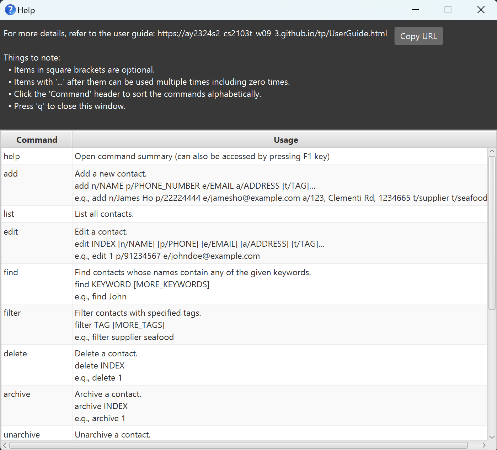
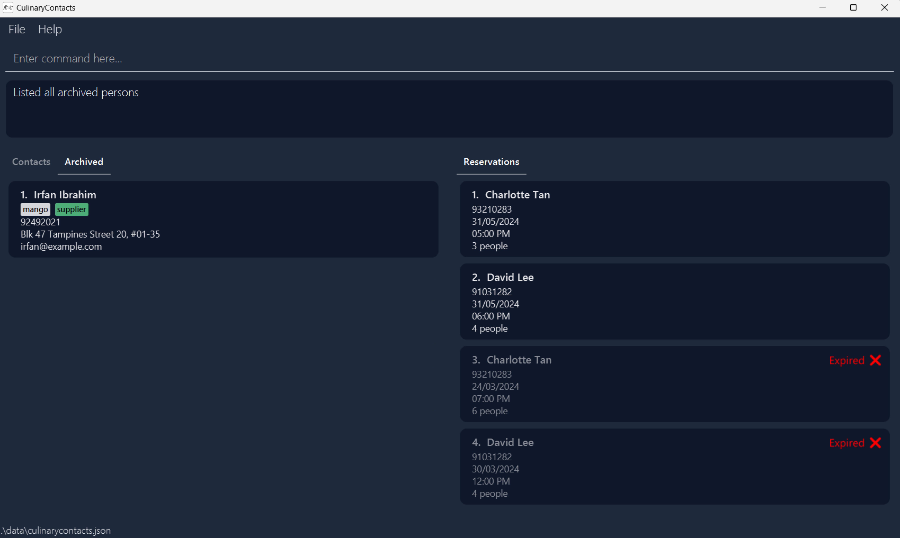
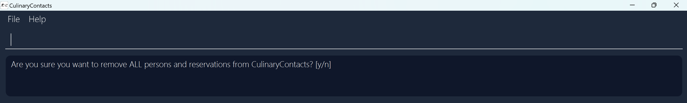

# CulinaryContacts User Guide

CulinaryContacts is a **desktop app for managing contacts, optimized for use via a  Line Interface** (CLI) while still having the benefits of a Graphical User Interface (GUI). If you can type fast, CulinaryContacts can get your contact management tasks done faster than traditional GUI apps.

<!-- * Table of Contents -->
* [Quickstart](#quickstart)
* [Navigating the User Guide](#navigating-the-user-guide)
* [Interpreting the GUI](#interpreting-the-gui)
    * [Main Window](#main-window)
    * [Contact Card](#contact-card)
    * [Reservation Card](#reservation-card)
* [Features](#features)
    * [Utility](#utility)
        * [Viewing help:`help`](#viewing-help-help)
        * [Clearing all entries: `clear`](#clearing-all-entries-clear)
        * [Saving the data](#saving-the-data)
        * [Editing the data file](#editing-the-data-file)
        * [Exiting the program: `exit`](#exiting-the-program-exit)
    * [Contacts](#contacts)
        * [Adding a person: `add`](#adding-a-person-add)
        * [Listing all persons: `list`](#listing-all-persons-list)
        * [Editing a person: `edit`](#editing-a-person-edit)
        * [Finding persons by name: `find`](#finding-persons-by-name-find)
        * [Filtering persons by tag: `filter`](#filtering-persons-by-tag-filter)
        * [Deleting a person: `delete`](#deleting-a-person-delete)
    * [Archive](#archive)
        * [Archiving a person: `archive`](#archiving-a-person-archive)
        * [Unarchiving a person: `unarchive`](#unarchiving-a-person-unarchive)
        * [Listing all archived persons: `alist`](#listing-all-archived-persons-alist)
    * [Reservations](#reservations)
        * [Adding a reservation: `rsv`](#adding-a-reservation-rsv)
        * [Deleting a reservation: `rsvdel`](#deleting-a-reservation-rsvdel)
        * [Sorting reservations: `rsvsort`](#sorting-reservations-rsvsort)
* [FAQ](#faq)
* [Known Issues](#known-issues)
* [Glossary](#glossary)
* [Command Summary](#command-summary)
--------------------------------------------------------------------------------------------------------------------

## Quickstart

1. Ensure you have Java `11` or above installed in your Computer.

1. Download the latest `culinarycontacts.jar` from [here](https://github.com/AY2324S2-CS2103T-W09-3/tp/releases).

1. Copy the file to the folder you want to use as the _home folder_ for CulinaryContacts.

1. Open a command terminal, `cd` into the folder you put the jar file in, and use the `java -jar culinarycontacts.jar` command to run the application. 
   A GUI similar to the below should appear in a few seconds. Note how the app contains some sample data. 
   

1. Type the command in the command box and press Enter to execute it. e.g. typing **`help`** and pressing Enter will open the help window. 
   Some example commands you can try:

   * `list` : Lists all contacts.

   * `add n/John Doe p/98765432 e/johnd@example.com a/John street, block 123, #01-01` : Adds a contact named `John Doe` to CulinaryContacts.

   * `delete 3` : Deletes the 3rd contact shown in the current list.

   * `clear` : Deletes all contacts.

   * `exit` : Exits the app.

1. Refer to the [Features](#features) below for details of each command.

--------------------------------------------------------------------------------------------------------------------

## Navigating the User Guide

--------------------------------------------------------------------------------------------------------------------

## Interpreting the GUI

### Main Window

### Contact Card

### Reservation Card

--------------------------------------------------------------------------------------------------------------------

## Features

<box type="info" seamless>

**Notes about the command format:** 

* Words in `UPPER_CASE` are the parameters to be supplied by the user. 
  e.g. in `add n/NAME`, `NAME` is a parameter which can be used as `add n/John Doe`.

* Items in square brackets are optional. 
  e.g `n/NAME [t/TAG]` can be used as `n/John Doe t/friend` or as `n/John Doe`.

* Items with `…`​ after them can be used multiple times including zero times. 
  e.g. `[t/TAG]…​` can be used as ` ` (i.e. 0 times), `t/friend`, `t/friend t/family` etc.

* Parameters can be in any order. 
  e.g. if the command specifies `n/NAME p/PHONE_NUMBER`, `p/PHONE_NUMBER n/NAME` is also acceptable.

* Extraneous parameters for commands that do not take in parameters (such as `help`, `list`, `exit` and `clear`) will be ignored. 
  e.g. if the command specifies `help 123`, it will be interpreted as `help`.

* If you are using a PDF version of this document, be careful when copying and pasting commands that span multiple lines as space characters surrounding line-breaks may be omitted when copied over to the application.
</box>

### Utility 

#### Viewing help: `help`

Shows the full command summary of CulinaryContacts at a glance.
Press 'q' to close the help window.

Format: `help`

Remove all persons and reservations from CulinaryContacts.

#### Clearing all entries: `clear`

Format: `clear`

* A pop-up confirmation message will appear, where the user must confirm their choice. 
  
    * If user types `y`, all contacts will be cleared and a success message will be shown: `CulinaryContacts has been cleared!`.
    * If user types `n` or anything else, the clear command will be cancelled and a message will be shown: `Clear cancelled!`.

#### Saving the data

CulinaryContacts data are saved in the hard disk automatically after any command that changes the data. There is no need to save manually.

#### Editing the data file

CulinaryContacts data are saved automatically as a JSON file `[JAR file location]/data/culinarycontacts.json`. Advanced users are welcome to update data directly by editing that data file.

<box type="warning" seamless>
**Caution:**
If your changes to the data file makes its format invalid, CulinaryContacts will discard all data and start with an empty data file at the next run.  Hence, it is recommended to take a backup of the file before editing it. 
Furthermore, certain edits can cause the CulinaryContacts to behave in unexpected ways (e.g., if a value entered is outside the acceptable range). Therefore, edit the data file only if you are confident that you can update it correctly.
</box>

#### Exiting the program: `exit`

Exits the program.

Format: `exit`

### Contacts

#### Adding a person: `add`

Adds a person to CulinaryContacts.

Format: `add n/NAME p/PHONE_NUMBER e/EMAIL a/ADDRESS [t/TAG]…​`

<box type="tip" seamless>

**Tip:** A person can have any number of tags (including 0).
</box>

Examples:
* `add n/Alex Yeoh p/87438807 e/alexyeoh@example.com a/Blk 30 Geylang Street 29, #01-40 t/supplier t/durian`
* `add n/David Lee p/91031282 e/david@example.com a/Blk 436 Serangoon Gardens Street 26, #02-43 t/customer`

#### Listing all persons: `list`

Shows a list of all persons in the contacts list of CulinaryContacts.

Format: `list`

#### Editing a person: `edit`

Edits an existing person in CulinaryContacts.

Format: `edit INDEX [n/NAME] [p/PHONE] [e/EMAIL] [a/ADDRESS] [t/TAG]…​`

* Edits the person at the specified `INDEX`. The index refers to the index number shown in the _displayed person list_. The index **must be a positive integer** 1, 2, 3, …​
* At least one of the optional fields must be provided.
* Existing values will be updated to the input values.
* When editing tags, the existing tags of the person will be removed i.e adding of tags is not cumulative.
* You can remove all the person’s tags by typing `t/` without
    specifying any tags after it.

Examples:
*  `edit 1 p/91234567 e/johndoe@example.com` Edits the phone number and email address of the 1st person to be `91234567` and `johndoe@example.com` respectively.
*  `edit 2 n/Betsy Crower t/` Edits the name of the 2nd person to be `Betsy Crower` and removes all existing tags.

#### Finding persons by name: `find`

Finds persons whose names contain any of the given keywords in the _displayed person list_.

Format: `find KEYWORD [MORE_KEYWORDS]`

* The search is case-insensitive. e.g `hans` will match `Hans`.
* The order of the keywords does not matter. e.g. `Hans Bo` will match `Bo Hans`.
* Only the name is searched.
* Only full words will be matched e.g. `Han` will not match `Hans`.
* Persons matching at least one keyword will be returned (i.e. `OR` search).
  e.g. `Hans Bo` will return `Hans Gruber`, `Bo Yang`.

Examples:
* `find John` returns `john` and `John Doe`.
* `find alex david` returns `Alex Yeoh` and `David Li`. 

#### Filtering persons by tag: `filter`

Finds persons that are tagged with all the given tags in the _displayed person list_.

Format: `filter TAG [MORE_TAGS]`

* The search is case-insensitive. e.g `supplier` will match with `Supplier`.
* Only full tags will be matched e.g. `supplier` will not match `suppliers`.
* Persons matching all tags will be returned (i.e. `AND` search).
  e.g. `seafood supplier` will return persons with both `seafood` and `supplier` tag.

Examples:
* `filter supplier` returns persons with the `supplier` tag.
* `filter supplier seafood` returns persons with both `supplier` and `seafood` tags.

#### Deleting a person: `delete`

Deletes the specified person from CulinaryContacts.

Format: `delete INDEX`

* Deletes the person at the specified `INDEX`.
* The index refers to the index number shown in the _displayed person list_.
* The index **must be a positive integer** 1, 2, 3, …​

Examples:
* `list` followed by `delete 2` deletes the 2nd person in the contacts list of CulinaryContacts.

### Archive

#### Archiving a person: `archive`
Removes the specified person from the contacts list and adds the person into the archived list.

Format: `archive INDEX`

* Archives the person at the specified `INDEX`.
* The index refers to the index number shown in the _displayed person list_. 
* The index **must be a positive integer** 1, 2, 3, ...
* This command can only be performed while viewing the contacts list. Type `list` to view the contacts list.

Examples:
* `list` followed by `archive 1` archives the 1st person in the contacts list of CulinaryContacts.

#### Unarchiving a person: `unarchive`
Removes the specified person from the archived list and adds the person back into the contact list.

Format: `unarchive INDEX`

* Unarchives the person at the specified `INDEX`.
* The index refers to the index number shown in the _displayed person list_.
* The index **must be a positive integer** 1, 2, 3, ...
* This command can only be performed while viewing the archived list. Type `alist` to view the archived list.

Examples:
* `alist` followed by `unarchive 1` unarchives the 1st person in the archived list of CulinaryContacts.

#### Listing all archived persons: `alist`

Shows a list of all persons in the archived list of CulinaryContacts.

Format: `alist`

Remove all persons and reservations from CulinaryContacts.

Format: `clear`

* A pop-up confirmation message will appear, where the user must confirm their choice. 
  
  * If user types `y`, all contacts will be cleared and a success message will be shown: `CulinaryContacts has been cleared!`.
  * If user types `n` or anything else, the clear command will be cancelled and a message will be shown: `Clear cancelled!`.

### Exiting the program: `exit`

Exits the program.

Format: `exit`

### Saving the data

CulinaryContacts data are saved in the hard disk automatically after any command that changes the data. There is no need to save manually.

### Editing the data file

CulinaryContacts data are saved automatically as a JSON file `[JAR file location]/data/culinarycontacts.json`. Advanced users are welcome to update data directly by editing that data file.

<box type="warning" seamless>
**Caution:**
If your changes to the data file makes its format invalid, CulinaryContacts will discard all data and start with an empty data file at the next run.  Hence, it is recommended to take a backup of the file before editing it. 
Furthermore, certain edits can cause the CulinaryContacts to behave in unexpected ways (e.g., if a value entered is outside the acceptable range). Therefore, edit the data file only if you are confident that you can update it correctly.
</box>

### Reservations

#### Adding a reservation: `rsv`

Adds a reservation to CulinaryContacts.

Format: `rsv INDEX d/DATE t/TIME p/PAX`
* Adds a reservation for the person at the specified `INDEX`. The index refers to the index number shown in the _displayed person list_.
* The index **must be a positive integer** 1, 2, 3, …​
* `DATE` **must be in yyyy-MM-dd** format.
* `TIME` **must be in HHmm** format.
* `PAX` **must be a positive integer**.

Example:
* `rsv 1 d/2024-04-17 t/1800 p/8`

#### Deleting a reservation: `rsvdel`

Deletes the specified reservation from CulinaryContacts.

Format: `rsvdel INDEX`
* Deletes the reservation at the specified `INDEX`.
* The index refers to the index number shown in the _displayed reservation list_.
* The index **must be a positive integer** 1, 2, 3, …​

Example:
* `rsvdel 2` deletes the 2nd reservation in CulinaryContacts.

#### Sorting reservations: `rsvsort`

Shows a sorted list of all reservations in CulinaryContacts.

Format: `rsvsort`
* Upcoming reservations are always on top of expired reservations.
* Upcoming reservations are sorted from earliest to latest.
* Expired reservations are also sorted from earliest to latest.

--------------------------------------------------------------------------------------------------------------------

## FAQ

**Q**: How do I transfer my data to another Computer? 
**A**: Install the app in the other computer and overwrite the empty data file it creates with the file that contains the data of your previous CulinaryContacts home folder.

--------------------------------------------------------------------------------------------------------------------

## Known Issues

1. **When using multiple screens**, if you move the application to a secondary screen, and later switch to using only the primary screen, the GUI will open off-screen. The remedy is to delete the `preferences.json` file created by the application before running the application again.

--------------------------------------------------------------------------------------------------------------------

## Glossary
* **displayed person list**: The contacts or archived list of persons that you are currently viewing.

--------------------------------------------------------------------------------------------------------------------

## Command Summary

| Command       | Format, Examples                                                                                                                                                             |
|---------------|------------------------------------------------------------------------------------------------------------------------------------------------------------------------------|
| **help**      | `help`                                                                                                                                                                       |
| **add**       | `add n/NAME p/PHONE_NUMBER e/EMAIL a/ADDRESS [t/TAG]…​`  e.g., `add n/Alex Yeoh p/87438807 e/alexyeoh@example.com a/Blk 30 Geylang Street 29, #01-40 t/supplier t/durian` |
| **list**      | `list`                                                                                                                                                                       |
| **edit**      | `edit INDEX [n/NAME] [p/PHONE_NUMBER] [e/EMAIL] [a/ADDRESS] [t/TAG]…​`  e.g.,`edit 2 n/James Lee e/jameslee@example.com`                                                  |
| **find**      | `find KEYWORD [MORE_KEYWORDS]`  e.g., `find James Jake`                                                                                                                   |
| **filter**    | `filter TAG [MORE_TAGS]`  e.g., `filter supplier seafood`                                                                                                                 |
| **delete**    | `delete INDEX`  e.g., `delete 3`                                                                                                                                          |
| **archive**   | `archive INDEX`  e.g., `archive 2`                                                                                                                                        |
| **alist**     | `alist`                                                                                                                                                                      |
| **unarchive** | `unarchive INDEX`  e.g., `unarchive 2`                                                                                                                                    |
| **rsv**       | `rsv INDEX d/DATE t/TIME p/PAX`  e.g., `rsv 1 d/2024-04-15 t/1800 p/4`                                                                                                    |
| **rsvdel**    | `rsvdel INDEX`  e.g., `rsvdel 1`                                                                                                                                          |
| **rsvsort**   | `rsvsort`                                                                                                                                                                    |
| **clear**     | `clear`                                                                                                                                                                      |

