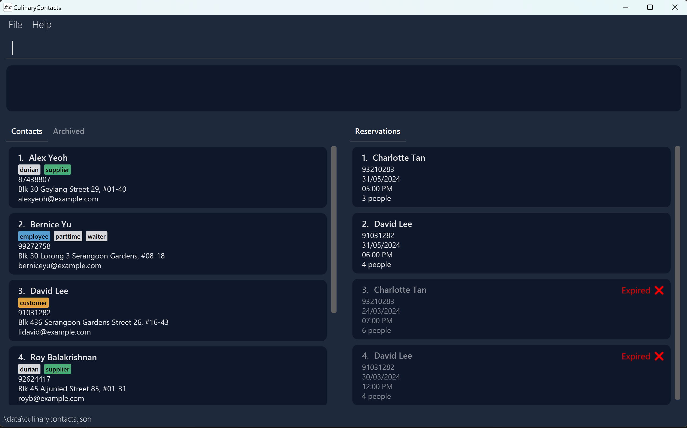

# CulinaryContacts

**CulinaryContacts is a desktop application for managing contact and reservation details in your restaurant.** While it has a GUI, most of the user interactions happen using a CLI (Command Line Interface).

* If you are interested in using CulinaryContacts, head over to the [_Quick Start_ section of the **User Guide**](UserGuide.html#quick-start).
* If you are interested about developing CulinaryContacts, the [**Developer Guide**](DeveloperGuide.html) is a good place to start.

**Acknowledgements**

Please refer to the [**Developer Guide's Acknowledgements section**](DeveloperGuide.html#acknowledgements).
